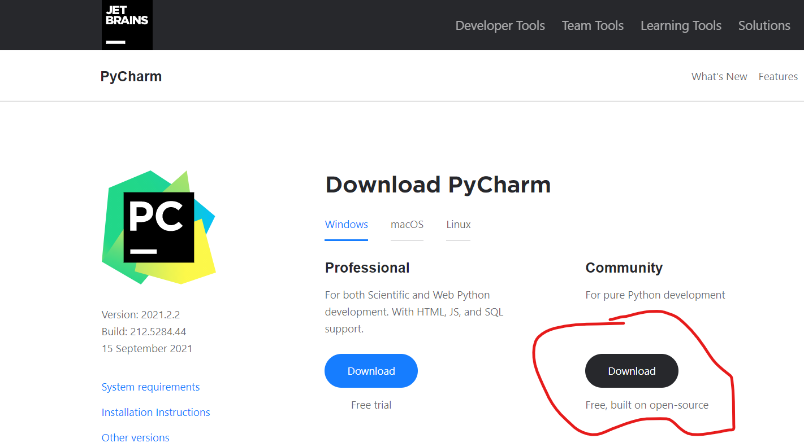
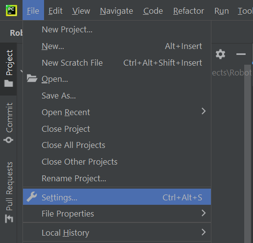
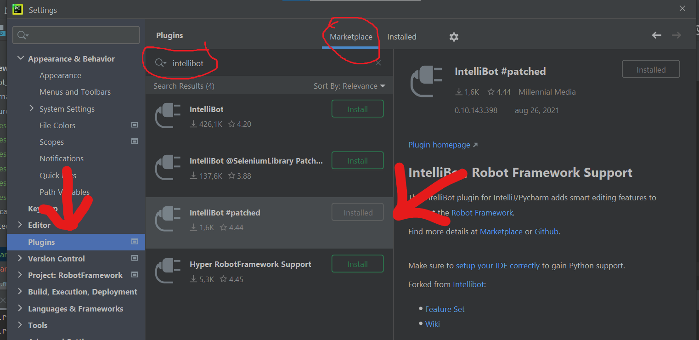
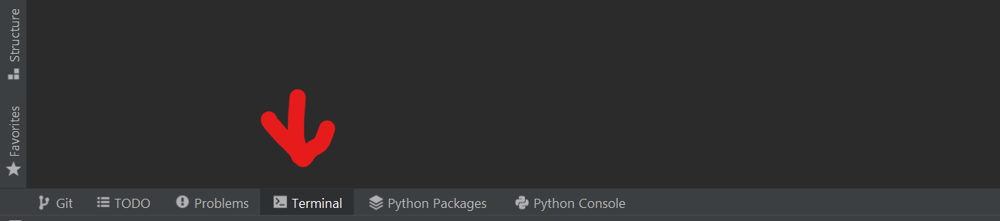

# RobotFramework
Robot Framework

## Installation
### Install Python interpreter on your computer
#### https://realpython.com/installing-python/

### Install Pycharm IDE on your computer
#### https://www.jetbrains.com/pycharm/download/#section=windows

### In pycharm got to Settings:

#### Next select Plugins tab
#### In upper side check that "Market place tab is selected"
#### In search type intellibot
#### in september 2021 working version is "Intellibot #patched"

### Click terminal tab at the bottom of Pycharm window

### Type in:
#### pip install robotframework
#### pip install robotframework-selenium

### After libraries are installed you are free to create *.robot files ant use Robot Framework
